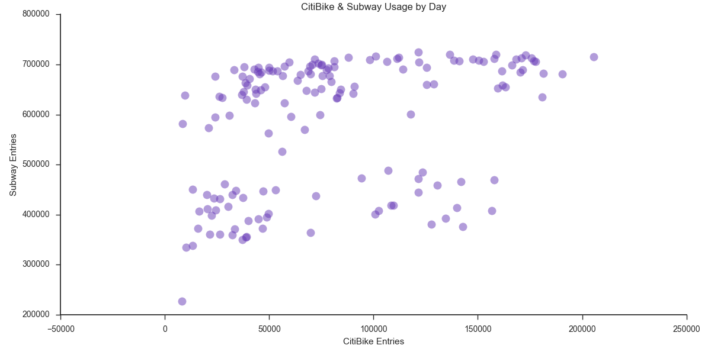
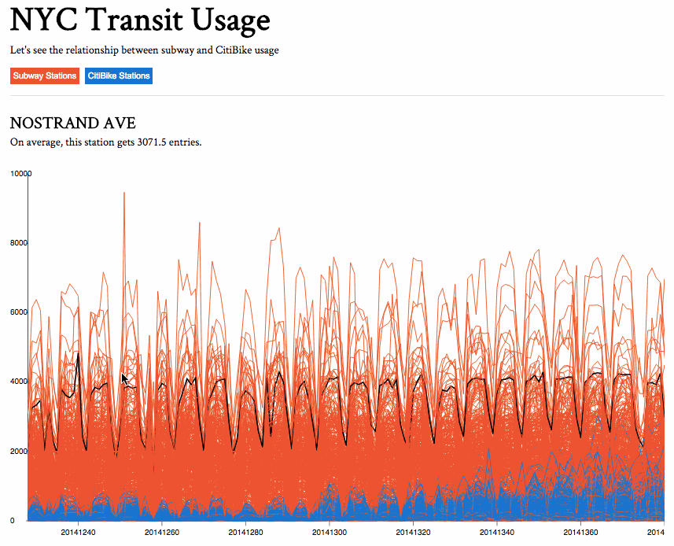
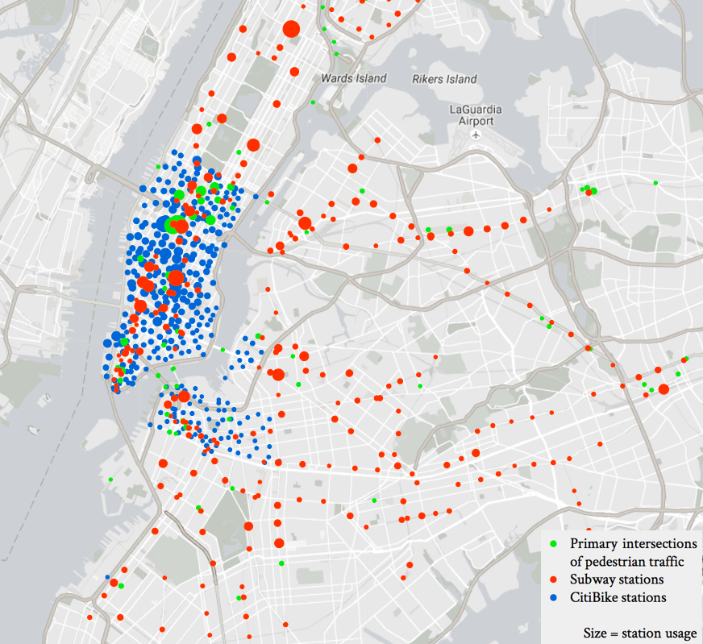
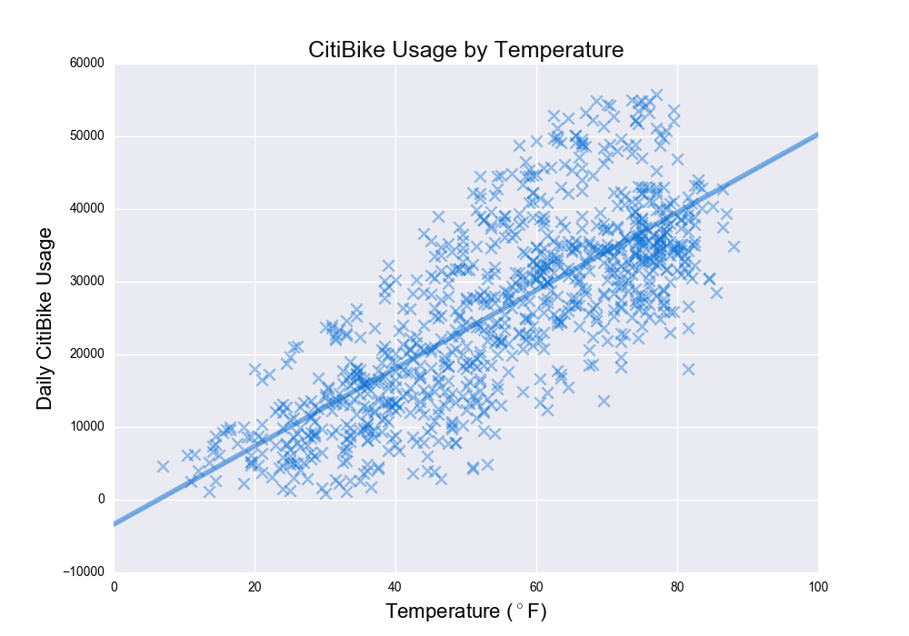
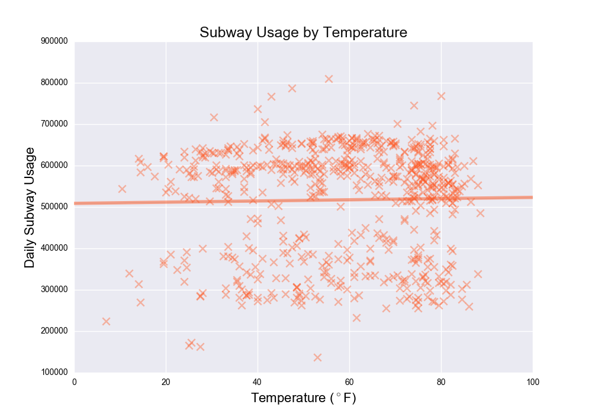

## Exploring New York City Transit
#### The Relationship Between Subway Usage and CitiBike Usage in NYC
Anurag Prasad (```anuragp1@bu.edu```) and Jarrod Lewis (```jl101995@bu.edu```)
___

#### Part I: Data Retrieval, Storage, Provenance, and Transformations

#### Overview
The objective of this project is to discover patterns or relationships between CitiBike usage and subway usage in New York City. This has potential to spot smart locations for bike hubs based on proximity to subways. With this information, we can see where it would be worth adding or removing CitiBike stations if there is a level of usage disproportional to the pedestrian traffic, or during which periods maintenance of these services is most important.

Note: for more detail, check out ```REPORT.md```.

#### Datasets
1. [Subway Stations](https://data.cityofnewyork.us/Transportation/Subway-Stations/arq3-7z49)
2. [Bi-Annual Pedestrian Counts](https://data.cityofnewyork.us/Transportation/Bi-Annual-Pedestrian-Counts/2de2-6x2h) 
3. [Subway Turnstile Data](http://web.mta.info/developers/turnstile.html)
4. [CitiBike System Data](https://www.citibikenyc.com/system-data)
5. [Central Park Weather Data](https://www.ncdc.noaa.gov/cdo-web/datasets/GHCND/stations/GHCND:USW00094728/detail)

#### Project Dependencies 
* python3.4+
* [dml](https://pypi.python.org/pypi/dml)
* [prov](https://pypi.python.org/pypi/prov)
* [pandas](http://pandas.pydata.org/)
* [matplotlib](http://matplotlib.org/)

#### Retrieve Data
1. Install project dependencies sand make sure you have ```retrieve_data.py``` and ```citizip_urls.txt``` in your working directory 
2. Run MongoDB with authentication
3. Retrieve the five initial datasets: ```$ python3 retrieve_data.py```

#### Data Transformations
Now the following transformations on the data (```user``` refers to the MongoDB user) can be run. Please run them in order. The transformation scripts are separated so that users can run transformations incrementally. 

**Transformation 1: Classify Subway Station by NYC Region**
**File**: ```transform_subway_region.py``` 
**Uses**: ```user.subway_stations```, ```user.pedestriancounts``` <!-- **Rationale**: The pedestrian counts in the [bi-annual pedestrian counts dataset](http:/www.nyc.gov/html/dot/downloads/pdf/bi-annual-ped-count-readme.pdf) is based on "114 locations, including 100 on-street locations (primarily retail corridors), 13 East River and Harlem River bridge locations, and the Hudson River Greenway." The subway dataset contains coordinates of each subway station, but we wanted a way to classify each subway by a region so we can eventually analyze each station's activity by foot traffic (pedestrian count) in its region. The bi-annual pedestrian counts dataset has carefully selected locations that are well-suited as standardized regions for measurement. --> 
**Creates**: ```user.subway_regions```
**Activities:**

* Uses 2D-sphere to classify each subway station into a region in bi-annual pedestrian counts dataset

**Transformation 2: Fix CitiBike Station Coordinates and Classify by NYC Region** 
**File**: ```transform_citibike_loc.py``` 
**Uses**: ```user.citibike``` , ```user.pedstriancounts``` <!-- **Rationale**: In order to do interesting things with CitiBike station coordinates, we need to get the coordinates in a more standardized, usable form. Also, we want to classify each CitiBike station by region like we did with subway stations. -->
**Creates**: ```user.citibikecoordinates```, ```user.citibike_by_region``` 
**Activities**: 

* Get location information and consolidate separate longitude/latitude fields to ```'the_geom' : {'type': 'Point', 'coordinates': [long, lat]}}``` format
* Uses 2D-sphere to classify each CitiBike station into a region in bi-annual pedestrian counts dataset

**Transformation 3: Get Total Subway Usage and Weather for Each Day** 
**File**: ```transform_turnstile_weather.py```
**Uses**: ```user.subway_stations```, ```user.turnstile```, ```user.weather``` <!-- **Rationale**:  To see the relationship between daily turnstile usage and weather. -->
**Creates**: ```user.turnstile_weather```, ```turnstile_total_byday```
**Activities**:

* Compute turnstile usage by day
* Combine weather data with daily subway usage 

**Transformation 4:  Get Total CitiBike Usage by Day and Weather for Each Day** 
**File**:  ```transform_citibike_weather.py``` 
**Uses**:  ```user.citibike```, ```user.weather``` <!-- **Rationale**: To see the relationship between daily CitiBike usage and weather. -->
**Creates**:  ```user.citibike_weather``` 
**Activities**: 

* Compute CitiBike usage by day
* Combine weather data with daily citibike usage 

**Transformation 5: Add Pedestrian Counts to Citibike and Subway Stations** 
**File**:  ```transform_citibike_pedestrian.py``` 
**Uses**: ```user.subway_regions```, ```user.pedestriancounts```, ```user.citibike_pedestrian.``` <!-- **Rationale**: To analyze the impact of pedestrian traffic on transit usage, we must link stations with their respective region's pedestrian counts -->
**Creates**:  ```user.daily_pedestrian```, ```user.subway_pedestriancount```, ```user.citibike_pedestriancount```
**Activities**:

* Compute daily average pedestrian count for each of the 114 pedestrian count regions
* Count usage of CitiBike stations by day and combine with pedestrian count for the station's corresponding region
* Count usage of subway stations by day and combine with pedestrian count for the station's corresponding region

**Transformation 6: Creates Three JSON Files for D3 Map Visualization**
**File**: ```transform_usage_json.py```
**Uses**: ```user.pedestriancounts```,```user.daily_pedestrian```, ```user.citibike```, 
          ```user.turnstile_total_byday```, ```user.subway_pedestriancount```', ```user.subway_stations```] <!-- **Rationale**: To create a D3 visualization of subway station, CitiBike station, and pedestrian region on a map with their usages, it is necessary to get each station with their coordinates and usage in JSON format. -->
**Creates**: ```user.citi_coord_json```, ```user.ped_coord_json```, ```user.subway_coord_json```
**Activities**:

* Get subway station coordinates and their usages 
* Get CitiBike station coordinates and their usages
* Get pedestrian region coordinates and their pedestrian counts 
* NOTE: The above code performs the original transformations and creates the necesary JSON files, but the following code loads in the cleaned JSON files that are needed for D3 map visualization

**Transformation 7: Get CitiBike Usage by Day**
**File**: ```transform_citibike_byday.py```
**Uses**: ```user.citibike``` <!-- **Rationale**: CitiBike usage by day is needed to later be combined to execute Transformation 8, in which we will include this usage in a time series. -->
**Creates**: ```user.citibike_startstation_byday```
**Activities**: 

* Load CitiBike data and clean erroneous date formats
* Get total usage of each CitiBike stations per day

**Transformation 8: Create CSVs for Time Series Visualizations, Calculate Correlation between Subway and CitiBike usage (and plot)**
**File**: ```transform_byday.py```
**Uses**: ```user.citibike_startstation_byday```, ```userturnstile_total_byday``` <!-- **Rationale**: To create a time series of Subway and CitiBike station usage by day and see the relationship between total subway usage and CitiBike usage -->
**Creates**: ```user.timeseries_csv```
**Activities**:  

* Combine CitiBike station usage by day and subway station usage by day into a usage time series for each station
* Make a CSV to be used for the D3 usage visualization
* Calculate the correlation coefficient between total subway usage and total CitiBike usage
* Create image of scatterplot between subway and CitiBike usage

**Transformation 9: Plot Effect of Weather on CitiBike/Subway Usage**
**File**: ```transform_plot_weather.py```
**Uses**: ```user.citibike_weather```, ```user.turnstile_weather``` <!-- **Rationale**: -->
**Creates**: ```citibike_temp_regression.png```, ```subway_temp_regression.png``` (no collections loaded into Mongo, only saving plot images)
**Activities**:

* Get temperature by day and join with subway/CitiBike usage by date
* Get precipitation by day and join with subway/CitiBike usage by date
* Calculate the correlation between temperature/precipitation and both CitiBike usage and subway usage


--- 
### Part II: Statistical Analysis Results
##### Statistical Analysis 1: Weather and Station Usage

| Independent Variable | Dependent Variable | Correlation | p-value |
| ------- | ----- | ------ | ------- |
| Precipitation | Subway Usage | -0.078 | 0.0478 |
| Temperature | Subway Usage | 0.206 | 0.603 |
| **Precipitation** | **CitiBike Usage** | **-0.253** | **1.053e-14** |  
| **Temperature** | **CitiBike Usage** | **.760** | **1.100e-171** |

It is apparent that citibike usage is much more sensitive to weather than subway usage. We expected the negative and positive correlations between CitiBike usage and precipitation/temperature respectively. These correlations make sense because New Yorkers take the subway no matter what conditions. Therefore, there wouldn't be much correlation between weather 

##### Statistical Analysis 2: Regression of Pedestrian Count on Subway Usage
After conducting a linear regression of region pedestrian count on the subway station entries, we generated the following regression parameters:

| Regression component | value |
| -------------------- | ------|
| slope     | 18.908     |
| intercept | 517937.435 | 	
| r-squared | 0.0855     |

This yields the regression equation:
 ```Subway_Usage = 517937 + 18.9*(Region_Pedestrian_Count)```
 Unfortunately the r-squared value indicates that the variation in pedestrian count by region *cannot* explain the variation in subway usage. This is a surprising finding for us because we expected subway station usage would be heavily effected by the pedestrian traffic in that station's region.
 
##### Statistical Analysis 3: Correlation between Aggregate Daily Subway Usage and CitiBike Usage
To see how subway usage varies with CitiBike usage, we ran a correlation on total usage by day for each of the transportation methods. Their correlation is 0.36 with a low p-value of 4.3 e-06. The following scatterplot displays the relationship between daily usage for each station type.


--- 

### Part III: Visualizations
To view the interactive visualizations (1 and 2):

* Install [http-server](https://www.npmjs.com/package/http-server)
* Navigate to the ```usage_vis``` or ```map_vis``` directory for the usage timeseries visualization or station usage visualization, respectively.
* ```$ http-server -c-1```
* View the ```.html``` page from the localhost

##### 1. Station Usage Timeseries


##### 2. Mapped Stations


##### 3. Effect of Weather




