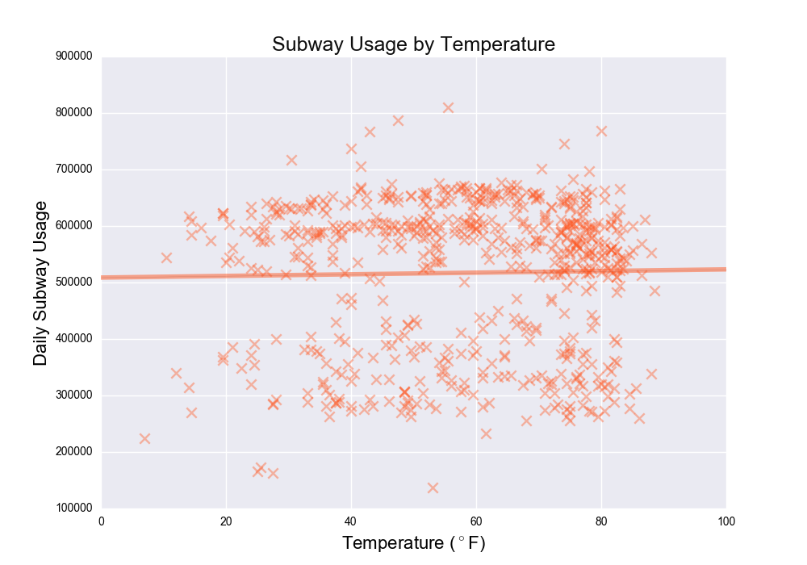
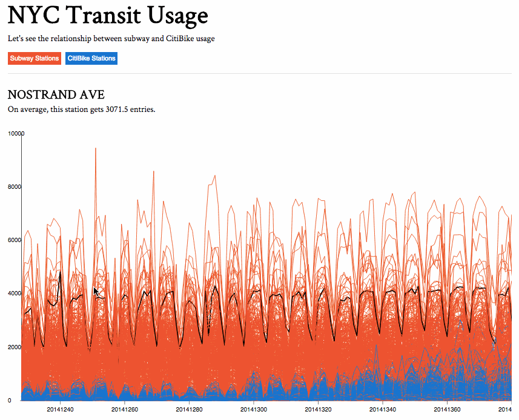

## Exploring New York City Transit
#### The Relationship Between Subway Usage and CitiBike Usage in NYC

Anurag Prasad (```anuragp1@bu.edu```) and Jarrod Lewis (```jl101995@bu.edu```)

CS591: Data Mechanics for Pervasive Systems and Urban Applications, Fall 2016
___

#### Introduction
Is there a relationship between subway ridership and CitiBike usage in New York City? This project aims to illustrate patterns between these two major forms of commute. First, we compare overall CitiBike usage with subway usage. Next, we analyze the effect of pedestrian traffic on station usage by classifying subway and CitiBike stations by designated regions. Lastly, we analyze the effect of weather on these modes of transit. With this information, we can see whether or not it will be worth adding or removing CitiBike stations if there is a level of usage disproportional to the pedestrian traffic, or during which months maintenance of these services is most important. This project has the potential to help identify smart locations for bike hubs based on proximity to subways. Our hypothesis was that it would be smarter to place more Bike Hubs around overcrowded subway stations. 

___

#### Datasets
We sourced the following datasets from NYC Open Data. 

* **[Subway Stations](https://data.cityofnewyork.us/Transportation/Subway-Stations/arq3-7z49)**: All subway stations with their geolocations.
* **[Subway Turnstile Data](http://web.mta.info/developers/turnstile.html)**: Turnstile entries for each subway station, but with a different naming convention than Subway Stations.
* **[Bi-Annual Pedestrian Counts](https://data.cityofnewyork.us/Transportation/Bi-Annual-Pedestrian-Counts/2de2-6x2h)**: Bi-annual pedestrian count of 114 regions, including 100 on-street locations (primarily retail corridors), 13 East River and Harlem River bridge locations, and the Hudson River Greenway. 
* **[CitiBike System Data](https://www.citibikenyc.com/system-data)**: A S3 bucket of CitiBike trip histories containing trip duration, start and end station names, and station coordinates.
* **[Central Park Weather Data](https://www.ncdc.noaa.gov/cdo-web/datasets/GHCND/stations/GHCND:USW00094728/detail)**: Daily weather information for Central Park region, which represents New York City weather as a whole. The dataset contains precipitation, temperature, date, and other descriptors which we chose not to use. We joined Subway Stations and Turnstile Data by date to derive the weather for each trip and day.

___

#### Methods
##### Data Transformations and Algorithms

The following outlines the series of data transformations, computations, and/or algorithms we applied. We used these to clean data, build our own datasets, compute metrics, and generate resources used for visualizations. 

* **Classify Subway Station by NYC Region** 
    The subway dataset contains coordinates of each subway station, but we wanted a way to classify each subway by a region so we could eventually analyze each station's activity by foot traffic (pedestrian count) in its region. The bi-annual pedestrian counts dataset has carefully selected regions that are well-suited as standardized regions for measurement. To classify each station, we used a 2D-sphere nearest-neighbors approach. In this approach, for each station we select the closest pedestrian region within a radius.

* **Fix CitiBike Station Coordinates and Classify by NYC Region** 
    In order to do interesting things with CitiBike station coordinates, we needed to get the coordinates in a more standardized, usable form. Also, we want to classify each CitiBike station by region like we did with subway stations. 

    The original format of the coordinates were:
    ```"start sttion longitude" : -73.97895137```
    ```"start station latitude" : 40.68312489```

    We converted this information to the following format:
    ```"the_geom" : 
            {"type": 'Point',
             "coordinates": [-73.97895137, 40.68312489]}
             }```

* **Get Total Subway Usage and Weather for Each Day** 
    To see the relationship between daily turnstile usage and weather, we computed turnstile usage by day and combined weather data with daily subway usage.

    Computing daily turnstile usage for each turnstile was tricky. The metadata states, "ENTRIES  = The cumulative entry register value for a device". This means the ```ENTRIES``` field is the entry count from the inception of the turnstile. First, we grouped the turnstiles by date and name. Then, for each day at that turnstile, we took the difference between the day's entry count– at index *i*– and the previous day's entry count, at index *i-1*.

    After computing daily turnstile usage for each turnstile, to get daily total subway usage, we aggregated the entries for all stations by date.

    Finally, we joined desired weather fields (temperature and precipitation) with the computed turnstile data by date. 

* **Get Total CitiBike Usage by Day and Weather for Each Day** 
    We also needed to understand the weather on CitiBike usage, so we used a similar approach to the previous method. We aggregated the entries at all CitiBike stations by date, and then combined weather data with aggregate CitiBike usage by date.

* **Add Pedestrian Counts to Citibike and Subway Stations** 
    To analyze the impat of pedestrian traffic on transit usage, it was necessary to link each station with its respective region's pedestrian count. 

    First, we computed daily average pedestrian counts for each of the 114 pedestrian count regions. The bi-annual pedestrian count contains measurements twice a year, each with an AM and a PM measurement. We averaged these counts to come to a daily average for each region.

    After, we counted the usage of CitiBike stations by day and combined this with pedestrian count for the station's corresponding region. We also did the same with subway stations.

* **Create JSON Files for D3 Map Visualization**
    To create a D3 visualization of subway station, CitiBike station, and pedestrian region on a map with their usages, we needed to get each station with their coordinates and usage in the following JSON format:

    ```{ "1 Ave & E 30 St":[-73.97536082, 40.74144387, 43713.0], "Point_Name" : [Longitude, Latitude, Usage], ... }```

    For subway and CitiBike station points we retrieved the stations' coordinates and usages (measured by entries). For pedestrian count points we took the regions' coordinates and their traffic (measured by pedestrian counts). 

* **Get CitiBike Station Usage by Day**
    Daily CitiBike usage for each station was needed to be combined with daily Turnstile station usage to create a combined station usage time series. We loaded CitiBike data and cleaned erroneous date formats. Lastly, we calculated total usage of each CitiBike station per day

* **Build Resources for Station Usage Time Series**
    To create a time series visualization of Subway and CitiBike station usage by day, we needed to organize the data in a specific format for our D3 Javascript scripts to use. 

    First, we combined CitiBike station usage by day and subway station usage by day into a usage time series for each station. While we loaded data into the MongoDB collection, we also generated CSVs that could be used by D3. 

    For the visualizations we required two CSV files. The first contains the 'type' of each station. C means CitiBike station and S means subway station. StationCode is the name of the station without non-alphanumeric characters. This was because we use the StationCode as a key in Javascript objects to retrieve the Station. 

    | StationCode | Type |
    |--------|------|
    | 6AveBroomeSt |  C |
    | 1AveE15St |  C |
    | 110ST | S|
    | 67AVE | S| 

    The second resource created was a CSV with rows corresponding to each station and columns corresponding to every single day from 12/21/2014 to 05/31/2015.

    | Station | StationCode | 20141228 | 20141229 | 20141230 | 
    | ----- | ----- | ----- | ---- | ----- |
    | 1 AVE | 1AVE | 1609 | 2212 | 2344 |

* **Combine Weather and CitiBike/Subway Usage**
    To illustrate and compare how weather influences ridership of CitiBikes and subways, we retrieved the temperature by day and joined the dataset with subway and CitiBike usage by date. Then, we joined data the same way with precipitation from the weather dataset. This facilitated the correlation calculation mentioned in question 1 under 'Statistical Analysis'.

##### Statistical Analysis
With subway usage, CitiBike usage, annual weather, and regional pedestrian counts, we found their relationship using statistical methods such as correlation and regression. With our datasets, we saw how CitiBike and subway usage varies with weather, as well as how they are affected by the region's population and pedestrian traffic.

We aimed to answer the following family of problems:

1. **How does CitiBike/subway usage vary with weather? Do riders prefer one over the other in certain weather conditions?**
    Before statistical analysis, we formed the following hypotheses:
    * There is a positive correlation between precipitation and subway ridership
    * There is slight positive correlation between temperature and subway ridership
    * There is a negative correlation between precipitation and CitiBike ridership
    * There is a positive correlation between temperature and CitiBike ridership 

    We solved this problem by combining subway usage, CitiBike usage, and weather by date. Once we had the total subway usage and totaly CitiBike usage for each day, we found the correlation between each of these usages and weather. 

2. **Can we predict subway usage from pedestrian count of a region using a linear regression model?**   
    A regression was run on these two variables. The results sections shows our regression parameters and discussion of the regression's (lack of) predictive power. 

    Before we could run this regression, we had to overcome the challenge of the subway usage and subway coordinates being in separate datasets. The main difficulty with this data separation, however, was the difference in naming convention for each station! Our initial data transformations did not involve this combining. We wrote algorithms to narrow down station name matches as closely as possible. But for the remaining station names we failed to match, we found the name discrepancies and matched them manually.

3. **How does overall CitiBike usage vary with subway usage?**
    To identify the relationship between total subway usage and CitiBike usage, we calculated the correlation and plotted a scatter plot between the usages for each transit type. 

___ 

#### Results
##### Regression of Pedestrian Count on Subway Usage
We generated the following regression parameters from our regression of region pedestrian count on the subway station entries:

| Regression component | value |
| -------------------- | ------|
| slope     | 18.908     |
| intercept | 517937.435 |  
| r-squared | 0.0855     |

This yields the regression equation:
 ```Subway_Usage = 517937 + 18.9*(Region_Pedestrian_Count)```

Unfortunately the r-squared value indicates that the variation in pedestrian count by region *cannot* explain the variation in subway usage. This is a surprising finding for us because we expected subway station usage would be heavily effected by the pedestrian traffic in that station's region. Perhaps if we had a more precise way of measuring pedestrian count in the subway's vicinity the regression would produce better results. However, our classification is based on pedestrian counts for the pre-selected regions used. Therefore, a limitation is that the pedestrian count metric used was for a wider radius that isn't completely specific to stations.
 
#####  Variation in Subway Usage with CitiBike Usage
To see how subway usage varies with CitiBike usage, we ran a correlation on total usage by day for each of the transportation methods. The correlation between subway and CitiBike usage is 0.36 with a low p-value of 4.3 e-06. The following scatterplot displays the relationship between daily usage for each station type.


##### Effect of Weather on CitiBike Usage
The strongest correlation we found in our investigation was between CitiBike usage and temperature. Subway usage did not correlate to any weather events which exemplified how inelastic this subway system is in New York. People will use the subway regardless of external conditions. The correlation between temperature and CitiBike usage is 0.76 with a very low p-value of 1.1 e-171 (much less than . 05).

| Independent Variable | Dependent Variable | Correlation | p-value |
| ------- | ----- | ------ | ------- |
| Precipitation | Subway Usage | -0.078 | 0.0478 |
| Temperature | Subway Usage | 0.206 | 0.603 |
| **Precipitation** | **CitiBike Usage** | **-0.253** | **1.053e-14** |  
| **Temperature** | **CitiBike Usage** | **.760** | **1.100e-171** |

It is apparent that CitiBike usage is much more sensitive to weather than subway usage. We expected the negative and positive correlations between CitiBike usage and precipitation/temperature respectively. These correlations make sense because New Yorkers rely heavily on the subway system. They are either willing to take it during cold temperatures, or they are simply reliant on it for commute.




##### Subway and CitiBike Station Time Series
This time series shows a very distinct weekly trend in which there are peaks during the typical work week and valleys on the weekends. The only exception to this trend can be seen in CitiBike usage where usage varies based on the time of year and rises during the summer, when use is more even across the weeks.



**Map of Stations**
Although there appear to be some clusters that support our hypothesis of high correlation between a region’s pedestrian traffic and its stations’ traffic, when we performed statistical analyses on this data, the expected correlations were not found. However, the 114 pedestrian count regions may have skewed our findings since they are not dispersed evenly throughout the regions in which CitiBike and subway stations exist. Further investigation that would be helpful is finding the correlation between CitiBike stations and subway stations near each other rather than near the same pre-defined regions.


___

#### Conclusion

Most of the correlations we expected to find were not found. There was a strong relationship between CitiBike usage and temperature, but not precipitation. There was no correlation between Subway Turnstile usage and weather factors. Also, we did not find a correlation between pedestrian counts and station usage. The lack of correlation seems to point toward variables which we did not have the opportunity to investigate. The Subway time series data shows a very strong weekly cycle, under which the usage is much higher during weekdays than during weekends. This suggests that subway usage is controlled by social and economic factors such as commute during working days.

What implications does this investigation have for Boston?* The subway system in New York operates on a much larger scale than the T in Boston. Despite having lower complexity than other transportation systems, the MBTA is still viewed as “a system reaching for expansion even as its core deteriorated.” ([Boston Globe 2015](https://www.bostonglobe.com/metro/2015/02/14/transportation/U7vNqP861gKQFRly2jmjdL/story.html)) We hope our findings motivate Boston city planners to explore whether or not such expansion is more valuable than expansion of alternative modes of transport such as bikes, taxis, and ridesharing services. Whereas in New York City the subway is a necessity and CitiBikes are dispensable, in Boston the T is often substituted for alternative modes of transportation. Therefore, we suspect that further investment in the T may not be as beneficial as investment in alternate modes of transportation.

#### Looking Ahead
We hope to build on this project in a variety of ways. 

First, our analysis would be stronger if we compared the usages of CitiBike stations and subway stations in the *same geographic area*. This would require a more specific nearest neighbhors approach. The challenge with this method is that each subway station would have multiple CitiBike stations near it. 

Next, an interesting opimtization problem would be: *If we had a budget reduction and had to remove a CitiBike station, which station would be the best choice to remove?* To solve this, we could take the following approach:

* Assume that the  optimal chioce of station to remove (i.e. the most "inefficient" station) would be the station that (1) within the same *M* meter radius of a subway and (2) has the lowest relative usage of those that satisfy (1). 
* State space: *2^N*, where *N* is the number of CitiBike stations
* For each of the N stations, 0 signifies not removing and 1 signifies removing the station
* Constraint: Choose 1 CitiBike station to remove (i.e. should be only a single 1 in a permutation)
* If *d* = distance from closest subway station for the *n*-th CitiBike station, *c* is the choice to remove or keep the n-th station (0 or 1), *U* represents the usage for the CitiBike station, and each list [ ... ] represents a possbile permutation of CitiBike stations within a *M* meter radius of a subway station, then our objective function *f*  is as follows:
    ```sum( [ U1(c1 * d1), U2(c2 * d2), .... , Un(cn * dn) ] , [ ... ], [ ... ] )```
* We're looking to minimize the objective function: ```argmin s ∈ S f(s)```

In addition, we could apply the same analysis we used with subway and CitiBikes on taxis and ridership services. The challenge of doing this would be that there aren't set stations for taxi cabs or Uber cars. However, we could define a taxi/Uber station as a coordinate radius with many pickups. 

Also, since we have the start and end coordinates for each CitiBike trip, we are curious to explore if there are patterns in trip paths. We expect that many of these CitiBike trips are of riders traveling toward subway stations. 

Lastly, K-means clustering could be performed to find regional clusters of stations. After assessing the centroids of these we could give them names based on the region they end up in. on the. It would be interesting to modify our time series visualization to see station usage filtered by cluster. 

#### Acknowledgements
Big thanks to [Andrei Lapets](http://cs-people.bu.edu/lapets/) who is one of the few professors to expose us to *real* applications of data analytics. It's a beautiful thing when real world solutions trace back to theory we learn. 


